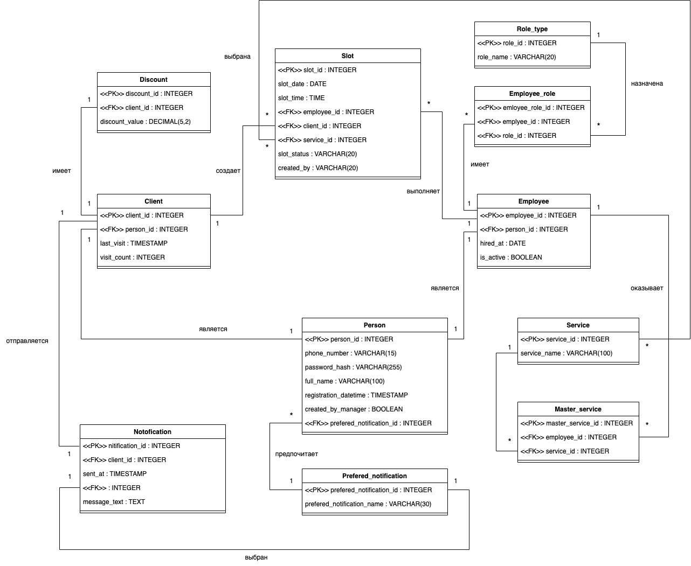

# Database & Object Modeling

Проект по анализу и моделированию предметной области барбершопа с онлайн-записью. В рамках работы разработана логическая модель данных, описаны основные сущности и их атрибуты, определены связи между объектами, роли пользователей и структура взаимодействия объектов системы.

## Задача

Спроектировать структуру данных для системы управления сетью барбершопов, которая поддерживает:

- регистрацию и хранение данных клиентов;
- хранение информации о сотрудниках;
- ведение справочника услуг;
- связь сотрудников с оказываемыми услугами;
- формирование временных слотов и запись клиентов;
- управление ролями и правами сотрудников;
- систему скидок;
- уведомления клиентов;
- хранение пользовательских предпочтений по способу уведомления.

Основное внимание уделено логической структуре данных и взаимосвязям между объектами предметной области.

## Что сделано

### Описание сущностей

Для ключевых объектов системы определены:

- назначение сущности;
- атрибуты и их типы;
- обязательность заполнения;
- первичные и внешние ключи;
- значения по умолчанию;
- ограничения и комментарии к атрибутам.

В модели выделены, в частности:

- `Person` — общая информация о пользователе системы;
- `Client` — данные клиента и история его посещений;
- `Employee` — данные сотрудника;
- `RoleType` — справочник ролей;
- `EmployeeRole` — связь сотрудников с ролями;
- `Service` — справочник услуг;
- `MasterService` — связь сотрудников с доступными им услугами;
- `Slot` — временные слоты для записи;
- `Discount` — информация о скидках клиента;
- `Notification` — отправленные клиентам уведомления;
- `PreferredNotification` — предпочтительный способ уведомления.

### Логическая модель данных

Определены основные связи между сущностями и их кардинальности.

Ключевые связи модели:

- `Person` — `Client`;
- `Person` — `Employee`;
- `Employee` — `EmployeeRole` — `RoleType`;
- `Employee` — `MasterService` — `Service`;
- `Client` — `Slot`;
- `Employee` — `Slot`;
- `Service` — `Slot`;
- `Client` — `Discount`;
- `Client` — `Notification`;
- `Person` — `PreferredNotification`.

Для идентификации связей используются первичные и внешние ключи.

### Диаграмма классов

Финальная диаграмма отражает структуру основных объектов системы, их атрибуты и отношения между ними.

Диаграмма показывает разделение справочных и операционных сущностей, связи `1:1` и `1:N`, а также промежуточные сущности для реализации связей `M:N`.

## Основные элементы модели

### Персоны, клиенты и сотрудники

Сущность `Person` содержит общие данные пользователя системы: идентификатор, контактные данные, имя, пароль и дату регистрации.

На её основе выделены специализированные сущности:

- `Client` — участник процесса записи на услуги;
- `Employee` — сотрудник барбершопа, участвующий в формировании расписания и оказании услуг.

Такое разделение позволяет не дублировать общие данные и использовать единую сущность персоны для разных ролей в системе.

### Услуги и сотрудники

Сущность `Service` представляет справочник услуг барбершопа.

Связь `Employee` и `Service` реализована через `MasterService`, поскольку один сотрудник может оказывать несколько услуг, а одна услуга может выполняться несколькими сотрудниками.

### Запись на услугу

`Slot` представляет временной интервал, доступный для записи.

Сущность связывает:

- дату и время;
- сотрудника;
- клиента;
- выбранную услугу;
- статус записи.

Таким образом, объект записи объединяет основные данные, необходимые для управления расписанием и бронированиями.

### Роли и права

Разделение ответственности сотрудников реализовано через сущности `RoleType` и `EmployeeRole`.

`RoleType` хранит набор ролей, а `EmployeeRole` связывает конкретного сотрудника с одной или несколькими ролями.

Это позволяет реализовать модель, в которой права определяются не непосредственно в сущности сотрудника, а через отдельную структуру ролей.

### Лояльность и уведомления

Для поддержки дополнительных сценариев выделены:

- `Discount` — информация о скидке клиента;
- `Notification` — история уведомлений;
- `PreferredNotification` — предпочтительный канал уведомлений.

Эти сущности отделены от основной записи на услугу, что позволяет независимо расширять соответствующую функциональность.

## Используемые подходы

В работе использованы:

- логическое моделирование данных;
- декомпозиция предметной области на сущности;
- определение атрибутов и их типов;
- первичные и внешние ключи;
- нормализация структуры данных;
- моделирование связей `1:1`, `1:N` и `M:N`;
- промежуточные сущности для реализации связей;
- UML class diagram;
- моделирование справочников и операционных сущностей;
- разделение объектов по ответственности и назначению.

## Результат

В результате сформирована согласованная логическая модель данных для системы онлайн-записи и управления барбершопом. Модель охватывает клиентов, сотрудников, услуги, расписание, роли, скидки и уведомления и может использоваться как основа для дальнейшего проектирования реляционной базы данных и прикладной системы.
